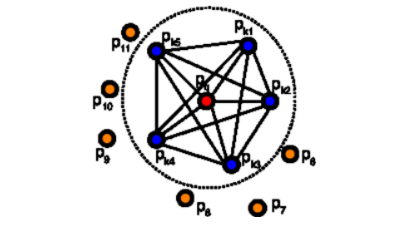
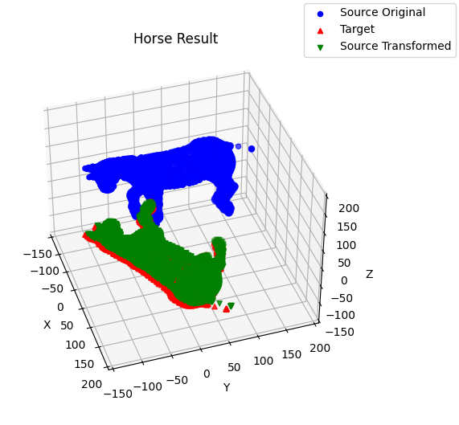
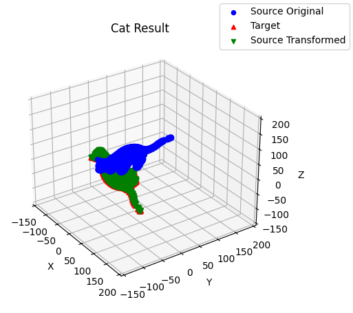

# Point Feature Histograms (PFH)

This project implements Point Feature Histograms (PFH), a method for capturing local geometric features around a point in a 3D point cloud.

## 🐎 1. Point Feature Histogram Introduction

PFHs are designed to be pose-invariant and encapsulate surface model properties through the spatial relationships of a point and its nearest neighbors. The process involves **analyzing 3D coordinates** and **surface normals** to **compute angular variations between points**, offering a robust descriptor for 3D shapes. This technique is particularly effective in representing complex geometries and has been optimized for efficiency.

## ⚙️ 2. Install Dependencies

```bash
virtualenv pfh_env
source pfh_env/bin/activate
pip install -r requirements.txt
```

## 📖 3. Theory

1. For each point $p$, all of $p$'s neighbors enclosed in the sphere with a given radius(`self.radius`) are selected.
2. For every pair of point $p_i$ and $p_j$ ($i$ $\neq$ $j$) in the k-neighborhood of $p$ and their estimated normals $n_i$ and $n_j$ ($p_i$ being the point with a smaller angle between its associated normal and the line connecting the points), we define a Darboux $uvn$ frame and computes the angular variation of $n_i$ and $n_j$.

- Define Darboux $uvn$ frame
  
 $$ u = n_i $$

 $$ v = (p_j − p_i) × u $$

 $$ w = u × v $$

- Computes the angular variation of $n_i$ and $n_j$
  
 $$ \alpha = v \cdot n_j $$

 $$ \phi = \frac{ (u \cdot (p_j − p_i)) }{||p_j − p_i||} $$

 $$ \theta = arctan(w \cdot n_j, u \cdot n_j) $$



## 📈 4. Result

[📝 Report](./result/rob422_point_feature_histogram.pdf)
Horse | Cat
----- | -----
|

## 📄 5. Related Papers & Reference

- Paper: [Fast Point Feature Histograms (FPFH) for 3D registration](https://ieeexplore.ieee.org/document/5152473)
- [Estimating Surface Normals in a PointCloud](https://pcl.readthedocs.io/projects/tutorials/en/latest/normal_estimation.html#normal-estimation)
- [Point Feature Histograms (PFH) descriptors](https://pcl.readthedocs.io/projects/tutorials/en/latest/pfh_estimation.html)

## 📫 6. Contact

- Yi-Cheng Liu, Email: <liuyiche@umich.edu>
- Tien-Li Lin, Email: <tienli@umich.edu>
